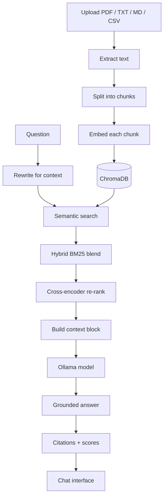
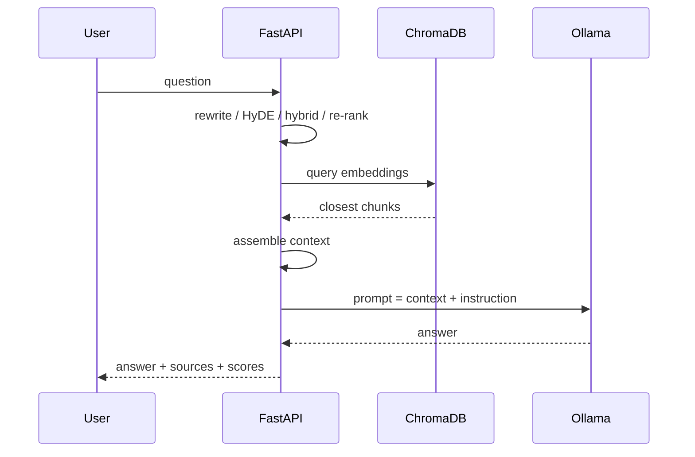

# RAG Cloud

A self-hosted document assistant. Upload PDFs or text files, ask a question, and get an answer written from those documents, with the source text attached.

Search runs over your uploaded documents only. The language model never fetches anything from the internet.

## How it works

An uploaded file goes through five stages before it can be searched:

| Stage | What happens |
| --- | --- |
| Extraction | PyMuPDF reads the PDF pages; plain text is read directly. |
| Chunking | Text is split into overlapping chunks. Three strategies are available: `auto` (recognises question-and-answer documents), `fixed`, and `recursive`. |
| Embedding | Every chunk is turned into a vector with `sentence-transformers`. |
| Indexing | The vectors are stored in ChromaDB with the source filename and chunk position. |
| Retrieval | A question is matched against the index; the closest chunks become the answer context. |



After retrieval, the answer path is:



All graphs run through `rag.py`, which owns extraction, chunking, storage, and retrieval. `app.py` exposes the HTTP layer, and `index.html` is the single-page front end.

## What it can do

- Upload one or many files at once: PDF, TXT, MD, CSV.
- Semantic search, plus optional hybrid search (TF-IDF BM25 blend), HyDE, cross-encoder re-ranking, and query rewriting from chat history.
- Streaming answers over SSE, shown token by token in the browser.
- Answers cite their sources, with faithfulness and relevance scores.
- Detects overview questions ("what is this document about?") and answers from a document summary.
- Falls back to keyword matching when the language model is unreachable, so the UI still responds.
- `strategy`, `use_hybrid`, `use_hyde`, `use_rerank`, `use_rewrite`, `top_k`, and source filters are per-question options the API accepts.
- Delete indexed documents with one call.

## Tech stack

| Layer | Tool |
| --- | --- |
| Backend | FastAPI, Uvicorn |
| Vector store | ChromaDB (cosine, persistent) |
| Embeddings / ranker | sentence-transformers (`all-MiniLM-L6-v2`, MS MARCO cross-encoder) |
| Language model | Ollama, local or Ollama Cloud |
| PDF parsing | PyMuPDF |
| Hybrid scoring | scikit-learn TF-IDF |
| Front end | Plain HTML, CSS, JavaScript |
| Deployment | Docker, docker-compose |

## Run it

### Local

```bash
pip install -r requirements.txt
uvicorn app:app --host 0.0.0.0 --port 8000
```

Open `http://localhost:8000`.

### Docker

```bash
docker compose up -d --build
```

Open `http://localhost:8000`.

### Environment variables

| Variable | Default | Purpose |
| --- | --- | --- |
| `OLLAMA_API_KEY` | empty | Uses Ollama Cloud when set, local Ollama otherwise. |
| `OLLAMA_MODEL` | `gemma4:31b-cloud` | Model tag. The cloud name drops the `-cloud` qualifier. |
| `OLLAMA_HOST` | `http://localhost:11434` | Local Ollama endpoint. |
| `OLLAMA_CLOUD_HOST` | `https://ollama.com` | Cloud endpoint. |
| `CHROMA_DIR` | `./chroma_db` | Vector store location. |
| `EMBED_MODEL` | `all-MiniLM-L6-v2` | Embedding model. |

Copy `.env.example` to `.env` for configuration. The file is gitignored.

## API

| Method | Path | Purpose |
| --- | --- | --- |
| GET | `/` | Serve the chat UI. |
| GET | `/health` | Server status and document count. |
| GET | `/documents` | Indexed files, with chunk counts. |
| POST | `/upload` | Add PDF or text files. |
| POST | `/ask` | One-shot answer (JSON). |
| POST | `/ask/stream` | Streaming answer over SSE. |
| POST | `/evaluate` | Faithfulness and relevance for a given answer. |
| POST | `/clear` | Delete all indexed documents. |
| GET | `/debug` | Ollama connectivity and installed models. |

## Project layout

```
app.py            HTTP API and prompt assembly
rag.py            extraction, chunking, embedding, retrieval, evaluation
index.html        chat front end
Dockerfile        container build
docker-compose.yml  container orchestration
.env.example      configuration template
```